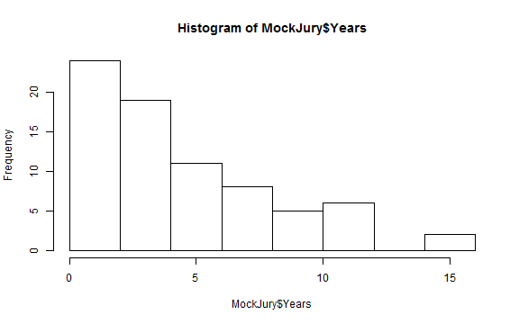
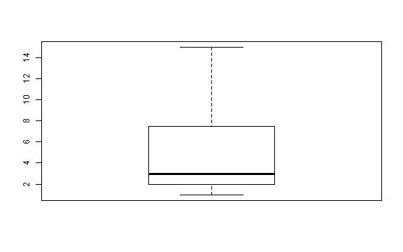

## Creating Variables

One of the nice things about R is that you can store information.  Here, assign the letter `x` to have a value of 3 by typing the following code into the console and hitting Enter.


```r
x <- 3
```

The `<-` symbol is the assignment operator in R.  Now, any time I type `x` R will return 3.


```r
x
```

```
#> [1] 3
```

I can now use `x` for addition


```r
x + 4
```

```
#> [1] 7
```

--- 

## Making Your New Variable

Copy and paste the following code into the R console.  This will assign `y` to have the value of 1024.


```r
y <- 1024
```

If you want to check and make sure this worked, type in `y` in the R console then hit enter.  If the object was correctly assigned then R should return 1024.  Otherwise, an error message will be printed.

--- &multitext

## Using Assigned Variables

Now that you have assigned `x` to be 3 and `y` to be 1024, let's use R to do some addition.

1. What is $3 + 1024 + 698$?  Copy and paste `x+y+698` into the R console and hit enter.


*** .hint
Make sure you have assigned `x` to have the value of 3 and `y` to have the value of 1024

*** .explanation
1. <span class='answer'>1725</span>

--- &radio
## An Error in R

Sometimes R doesn't understand what we are trying to tell it.  It will generate an error.  Copy and paste `x+Y+698` and hit enter.  A bright red error message should occur.  Why is this?

1. R hates me 
2. _R is case sensitive and I used a capital Y_
3. R can only execute commands once

*** .hint
Note that the "Y" has been capitalized

---
## R Scripts

Scripts are very useful in R because the allow us to save the commands that we've run.  To open up a script, click **File** -> **New File** -> **R Script**.  A new script should appear and your screen should look something like this.

<iframe src='img/new-r-script.png' width='700' height='400' frameborder='0'>
</iframe>

You can type a line of code into the R script, then hit Ctrl+Enter to run that line.  Try typing 3+4 into your new R script then running that.  It should look something like

<iframe src='img/r-script-line-of-code.png' width='700' height='600' frameborder='0'>
</iframe>

---
## Mock Jury Data

Here, we'll need to reproduce the plots from Wednesday in class.  To begin, we need to load the `heplots` package.  Make sure the `heplots` package is installed (see the last paragraph of page 12 in your book) then type `require(heplots)` into your R script on a new line and run that line of code.  This loads all the code and datasets associated with the `heplots` package.


```r
require(heplots)
```

We need to do some work to set up the data.  You can just copy and paste this section into your script and run it.


```r
data(MockJury)
MockJury <- subset(MockJury, Attr != "Beautiful", select = c(Attr, Crime, Years, Serious, independent, sincere))
rownames(MockJury) <- 1:nrow(MockJury)
```

The dataset is now named "MockJury."  You can now view it by running


```r
MockJury
```

---
## Some R commands

Instead of viewing the entire dataset, you can just the first six rows using "head"


```r
head(MockJury)
```

```
#>           Attr    Crime Years Serious independent sincere
#> 1 Unattractive Burglary     1       3           6       5
#> 2 Unattractive Burglary     4       8           2       9
#> 3 Unattractive Burglary     3       5           9       7
#> 4 Unattractive Burglary     2       2           7       1
#> 5 Unattractive Burglary     8       5           5       1
#> 6 Unattractive Burglary     8       9           2       8
```

Try


```r
tail(MockJury)
```

```
#>       Attr   Crime Years Serious independent sincere
#> 70 Average Swindle     3       2           9       9
#> 71 Average Swindle     2       1           8       8
#> 72 Average Swindle     7       4           9       1
#> 73 Average Swindle     6       3           5       2
#> 74 Average Swindle    12       9           9       1
#> 75 Average Swindle     8       8           1       5
```

--- &radio
## The `tail` function

What does `tail(MockJury)` do?

1. Prints the first six rows of the dataset
2. Prints six randomly selected rows from the dataset
3. _Prints the last six rows of the dataset_
4. Summarizes the dataset

*** .hint
Look at the row numbers

--- 
## Selecting Variables

Each column in the dataset is named (these named columns are called variables).  You can tell R to only print the "Years" variable using the dollar sign.


```r
MockJury$Years
```

```
#>  [1]  1  4  3  2  8  8  1  1  5  7  1  5  2 12 10  1  6  2  5 12  6  3  8
#> [24]  4 10 10 15 15  3  3  3 11 12  2  1  1 12  5  5  4  3  6  4  9  8  3
#> [47]  2 10  1  1  3  1  3  5  8  3  1  1  1  2  2  1  1  2  3  4  5  3  3
#> [70]  3  2  7  6 12  8
```

---
## More R functions

We can easily compute numerical summaries of variables using R functions.  Here, we compute the mean and standard deviation of the Years variable.


```r
mean(MockJury$Years)
```

```
#> [1] 4.88
```

```r
sd(MockJury$Years)
```

```
#> [1] 3.755932
```

The `summary` function is very useful in R.  For a quantitative variable, it will return the 5 number summary as well as the mean.


```r
summary(MockJury$Years)
```

```
#>    Min. 1st Qu.  Median    Mean 3rd Qu.    Max. 
#>    1.00    2.00    3.00    4.88    7.50   15.00
```

---
## Plotting in R

We can use the `hist` and `boxplot` functions to make histograms and boxplots of the Years variable.


```r
hist(MockJury$Years)
```



```r
boxplot(MockJury$Years)
```




